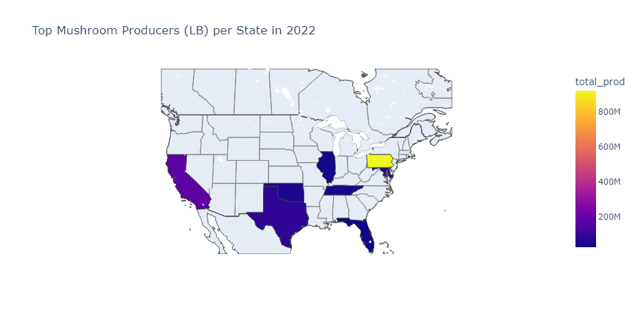

# An Analysis of USDA NASS Agriculture

This repository contains the code used for analyzing mushroom and corn production in
different US states (so far).

## TODO
- [x] Turn functions from 'NASS Agri with Geopandas.ipynb' into a module
- [x] Create Sample Choropleth Plots using Plotly
- [ ] Create Plotly functions for the GeoDataFrames
- [ ] Add Basic Dash App

### Screenshots

Sample Plot for Mushroom Production

## Getting Started

### Installation

### Running the App Locally

## Details

### How the Data was Downloaded

### Application Structure